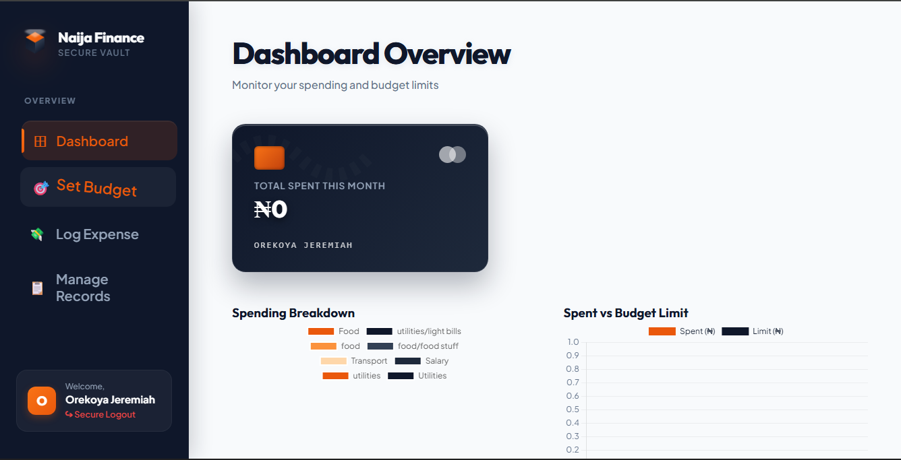
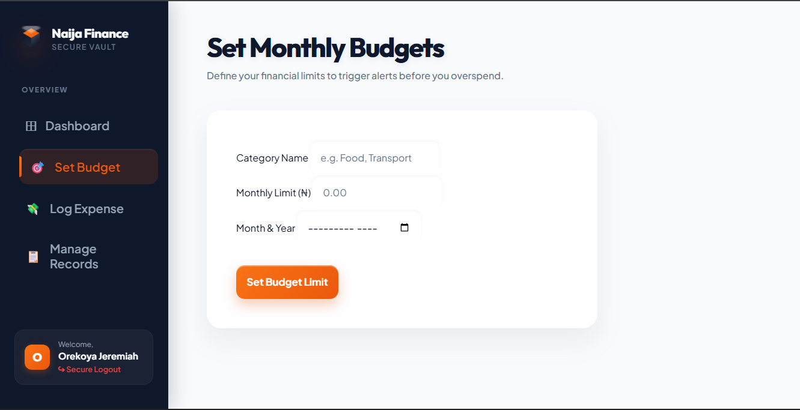
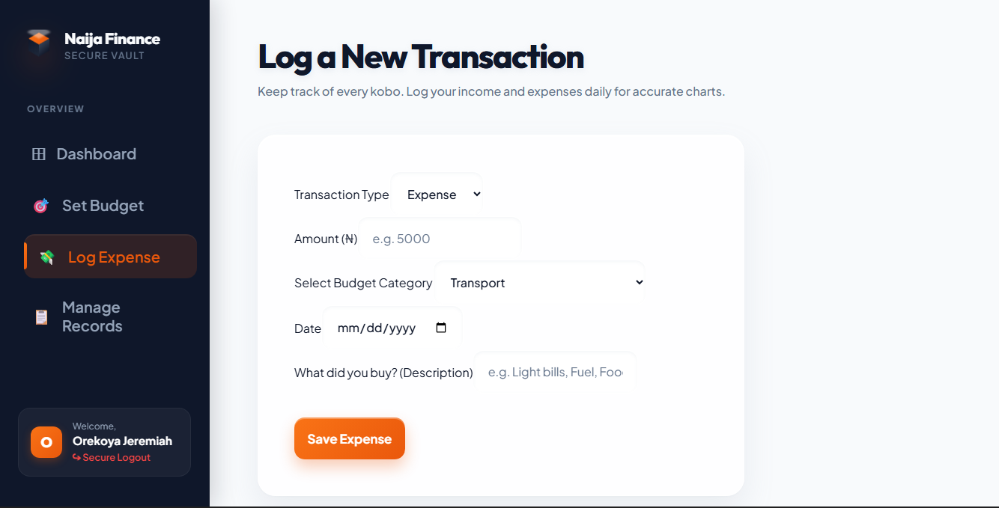
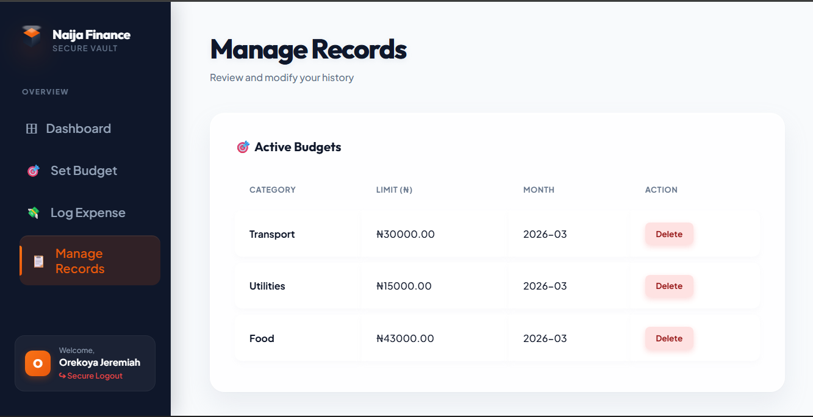

# Naija Finance — Personal Finance Visualizer

> A full-stack budget tracking and expense visualization platform built for Nigerian users, with real-time charts, automated recurring transactions, and granular budget alerts.

[](https://naija-finance.vercel.app)
[](./LICENSE)
[](https://react.dev)
[](https://nodejs.org)

---

## 🔗 Live Demo

**[naija-finance.vercel.app](https://naija-finance.vercel.app)**

> Backend API hosted on Render · Database on TiDB Cloud (MySQL-compatible, serverless)

---

## 📸 Screenshots

| Dashboard Overview | Set Monthly Budgets |
|---|---|
|  |  |

| Log a Transaction | Manage Records |
|---|---|
|  |  |

---

## About

Naija Finance is a full-stack personal finance management platform tailored for Nigerian users (₦ NGN). It features a dark glassmorphism UI, real-time spending charts, automated recurring transaction scheduling, and a tiered budget alert system — all secured with JWT authentication and refresh token rotation.

Built as a Final Year Project for the Computer Science Department.

---

## Features

- 💳 **Interactive Dashboard** — Credit card-style spending summary with real-time totals
- 📊 **Dynamic Charts** — Pie and bar charts via Chart.js for spending breakdown and budget vs. spent comparisons
- 🎯 **Granular Budget Alerts** — Visual indicators at 50%, 75%, and 90% of category spending limits
- 💸 **Transaction Logger** — Log both Income and Expenses with category tagging
- 🔁 **Automated Recurring Transactions** — Background `node-cron` scheduler auto-logs fixed costs (subscriptions, rent, etc.)
- 🔐 **Secure Authentication** — JWT access tokens (15min) + refresh token rotation (7 days)
- 📋 **Manage Records** — View, edit, and delete active budgets and transaction history

---

## Tech Stack

| Layer | Technology |
|---|---|
| Frontend | React 18, Axios, Chart.js, CSS Glassmorphism |
| Backend | Node.js, Express.js, node-cron |
| Database | TiDB Cloud (MySQL-compatible, serverless) |
| Auth | JWT (access + refresh token rotation) |
| Deployment | Vercel (frontend) · Render (backend) |

---

## Getting Started (Local)

### Prerequisites

- Node.js v18+
- MySQL or TiDB Cloud account

### 1. Clone the repo

```bash
git clone https://github.com/Engrojkeh/naija-finance.git
cd naija-finance
```

### 2. Database Setup

Create a database named `budget_tracker`. The app auto-creates all tables (`users`, `categories`, `budgets`, `transactions`, `recurring_transactions`) on first connection.

### 3. Backend Setup

```bash
cd budget-tracker
npm install
cp .env.example .env   # fill in your credentials
npm start
```

Your `.env` should contain:

```
PORT=5000
DB_HOST=your_db_host
DB_USER=your_db_user
DB_PASSWORD=your_db_password
DB_NAME=budget_tracker
ACCESS_TOKEN_SECRET=generate_a_strong_random_secret
REFRESH_TOKEN_SECRET=generate_a_strong_random_secret
```

> Generate strong secrets with: `node -e "console.log(require('crypto').randomBytes(64).toString('hex'))"`

### 4. Frontend Setup

```bash
cd frontend
npm install
npm start
```

App runs at `http://localhost:3000`, backend at `http://localhost:5000`.

To point the frontend at your local backend, create `frontend/.env`:

```
REACT_APP_API_URL=http://localhost:5000/api
```

---

## Testing the App

1. **Register** a new account at `http://localhost:3000`
2. **Set Budgets** — assign monthly limits per category (e.g. Food: ₦10,000)
3. **Log Transactions** — add income and expenses with categories and dates
4. **View Alerts** — watch the 50%, 75%, 90% indicators trigger on the dashboard
5. **Recurring Transactions** — the cron job runs at midnight daily to auto-log fixed costs

---

## Project Structure

```
naija-finance/
├── budget-tracker/         # Express API
│   ├── controllers/        # Auth, budget, transaction logic
│   ├── middleware/         # JWT auth middleware
│   ├── routes/             # API route definitions
│   ├── scheduler/          # node-cron recurring jobs
│   ├── config/             # DB connection
│   ├── .env.example        # Environment variable template
│   └── server.js
├── frontend/               # React app
│   └── src/
│       ├── services/api.js # Axios instance + token refresh logic
│       ├── pages/          # Dashboard, Budgets, Transactions, Records
│       └── components/     # Shared UI components
├── .gitignore
└── README.md
```

---

## License

This project is licensed under the [MIT License](./LICENSE).

---

## Author

**Engrojkeh** · [GitHub](https://github.com/Engrojkeh) · [Live App](https://naija-finance.vercel.app)